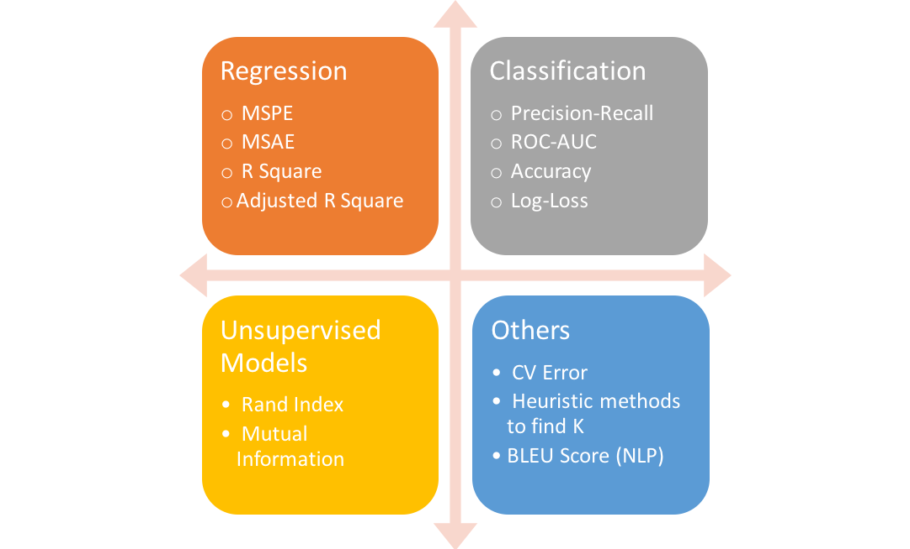

# Performance Metrics for Classification and Regression problems in Machine Learning
---
The metrics that you choose to evaluate your machine learning algorithms are very important.
There are many metrics to measure the performance of your model depending on the type of machine learning algorithm.

  
## Classification Metrics
* Classification Accuracy.
* Log Loss.
* Area Under ROC Curve.
* Confusion Matrix.
* Classification Report.

More about each metric:

( https://machinelearningmastery.com/metrics-evaluate-machine-learning-algorithms-python/ )

## Regression Metrics
* Mean Absolute Error.
* Mean Squared Error.
* R^2.
* R^2 adjusted.
